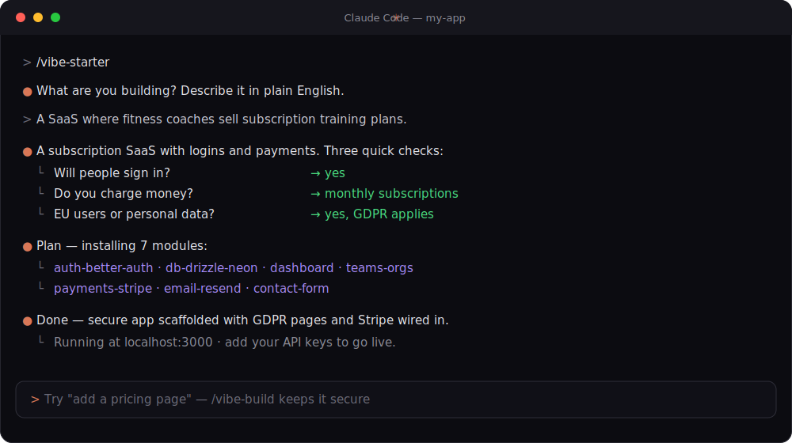
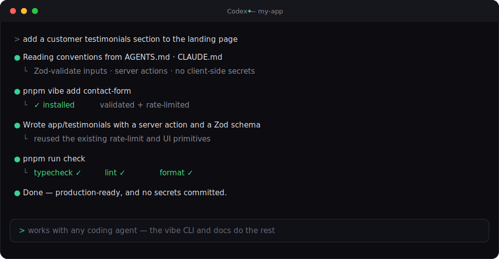
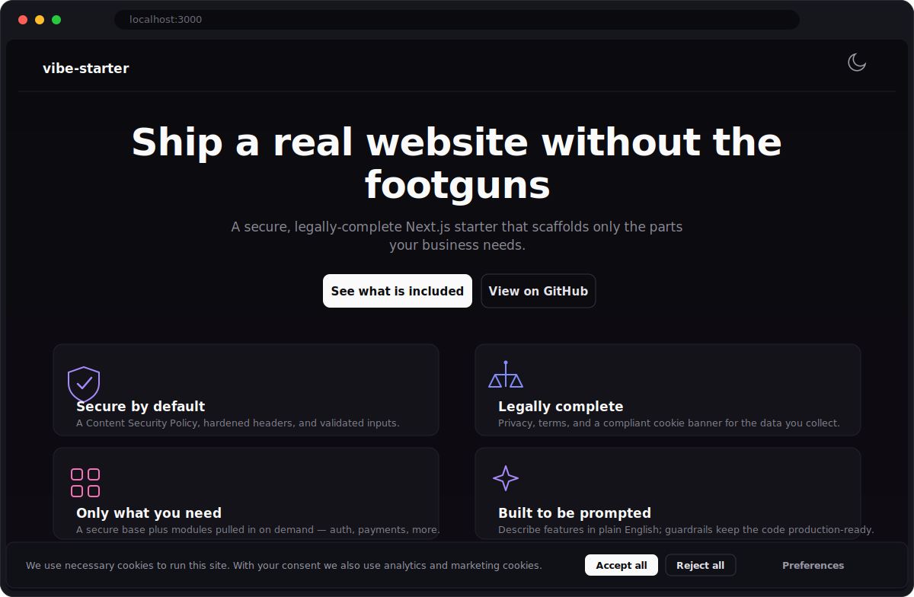
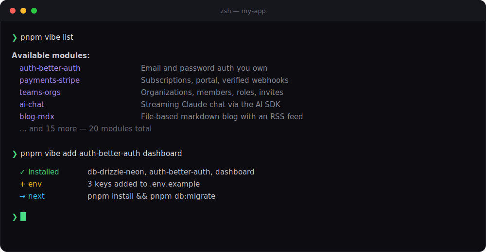

<div align="center">


<br/>

**A production-ready Next.js starter you drive with Claude Code, Codex, or any coding agent —<br/>ship a real website without first becoming a security engineer or a privacy lawyer.**

<br/>

[](https://github.com/Falcon305/vibe-starter/actions/workflows/ci.yml)
[](./LICENSE)
[](https://nextjs.org)
[](https://www.typescriptlang.org)
[](./docs/modules.md)

[Quickstart](#-quickstart) · [Modules](#-modules) · [The skills](#-the-skills) · [Docs](./docs)

</div>

---

Most starter templates hand you an empty app and wish you luck. vibe-starter is different: it is a
**secure base** plus a **library of feature modules**, driven by **coding agents** that interview
you about your business idea and assemble only the parts you actually need — with the legal pages,
cookie consent, and security hardening already done the way a senior engineer would.

## 🤖 Built for coding agents

This is the main event. Run it inside **Claude Code** and the `/vibe-starter` skill interviews you
in plain English, then scaffolds a tailored, secure app — no boilerplate archaeology.

<div align="center">
  
</div>

Using **Codex**, **Cursor**, or another agent? The same guardrails live in [`AGENTS.md`](./AGENTS.md),
and the `vibe` CLI composes modules straight from the terminal — so every agent keeps the code
secure and production-ready.

<div align="center">
  
</div>

## 📦 What it builds

Every scaffold starts from the same secure, legally-complete base — themed, accessible, and
deployable on its own:

<div align="center">
  
</div>

See a full example: [**vibe-starter-demo**](https://github.com/Falcon305/vibe-starter-demo) is a SaaS
scaffolded from this starter with auth, a dashboard, Stripe test-mode checkout, and a contact form.

## ✨ What you get out of the box

|                              |                                                                                                                                                |
| ---------------------------- | ---------------------------------------------------------------------------------------------------------------------------------------------- |
| 🛡️ **Secure by default**     | Nonce-based Content Security Policy, hardened headers, and Zod-validated inputs wired in before you write a line.                              |
| ⚖️ **Legally complete**      | GDPR / CCPA privacy, terms, and cookie pages with a compliant, equal-weight consent banner — generated to match the data you actually collect. |
| 🧩 **Only what you need**    | A secure base plus a registry of 24 modules the scaffolder pulls in on demand — auth, payments, AI, and more.                                  |
| 🤖 **Built to be prompted**  | Keep building by describing features in plain English while the skills keep the code production-ready.                                         |
| 🔑 **Typed environment**     | Env vars validated at build time; server secrets can never reach the client.                                                                   |
| 🚦 **Green from commit one** | Strict TypeScript, ESLint, Prettier, secret scanning, and CI on every push.                                                                    |

## 🚀 Quickstart

```bash
git clone https://github.com/Falcon305/vibe-starter my-app
cd my-app
pnpm install
cp .env.example .env.local
pnpm dev
```

Then, inside Claude Code, run the scaffolder and describe your business in plain English:

```
/vibe-starter
```

It figures out which modules you need, installs them, generates your legal pages, and leaves you
with a running, deployable app. Using another agent? Point it at [`AGENTS.md`](./AGENTS.md) and let
it drive the `vibe` CLI.

### Add capabilities anytime

The `vibe` CLI composes modules shadcn-style — it copies real source into your repo and rewires
dependencies, env, database schema, CSP, and legal pages to match.

<div align="center">
  
</div>

## 🤖 The skills

| Skill            | What it does                                                       |
| ---------------- | ------------------------------------------------------------------ |
| `/vibe-starter`  | Interviews you and scaffolds a tailored app from your idea.        |
| `/vibe-build`    | Adds features by prompting while enforcing the security checklist. |
| `/vibe-security` | Audits the current app against the security baseline.              |
| `/vibe-legal`    | Regenerates legal pages when your data practices change.           |

## 🧩 Modules

Run `pnpm vibe list` to see them, or let `/vibe-starter` pick. Twenty-four modules cover the full
stack — pick one `db` and one `auth`, add the rest as you need them.

| Group                    | Modules                                                                                                                                |
| ------------------------ | -------------------------------------------------------------------------------------------------------------------------------------- |
| **Data & auth**          | `db-drizzle-neon` · `db-supabase` · `auth-better-auth` · `auth-supabase` · `auth-clerk` · `auth-social` · `auth-passkeys` · `auth-2fa` |
| **App surface**          | `dashboard` · `admin` · `teams-orgs` · `file-upload`                                                                                   |
| **Monetization & comms** | `payments-stripe` · `email-resend` · `notifications`                                                                                   |
| **Growth & content**     | `waitlist` · `contact-form` · `blog-mdx` · `analytics-plausible` · `analytics-umami`                                                   |
| **AI, i18n & ops**       | `ai-chat` · `i18n` · `monitoring-sentry` · `rate-limit-upstash`                                                                        |

See the [module catalog](./docs/modules.md) for what each one provides and depends on.

```bash
pnpm vibe search auth
pnpm vibe add auth-better-auth dashboard
pnpm install
pnpm vibe doctor
```

`vibe update <module>` pulls registry fixes into an installed module, and `vibe doctor` audits the
installed set for conflicts, drift, and leaked secrets.

## 🧱 Stack

Next.js 16 (App Router) · React 19 · TypeScript (strict) · Tailwind CSS v4 · shadcn/ui · Better Auth
· Drizzle ORM · Postgres · Zod. Optimized for Vercel, self-hostable anywhere.

## 📚 Documentation

- [Getting started](./docs/getting-started.md) — your first project, end to end
- [Architecture](./docs/architecture.md) — the base, the registry, and how the installer works
- [Security model](./docs/security.md) — CSP, headers, validation, and the threat model
- [Module catalog](./docs/modules.md) & [authoring guide](./docs/module-authoring.md)
- [CLI reference](./docs/cli.md) · [skills](./docs/skills.md) · [env vars](./docs/environment.md)
- [Testing](./docs/testing.md) · [deployment](./docs/deployment.md) · [troubleshooting](./docs/troubleshooting.md)

## 📄 License

[MIT](./LICENSE)
